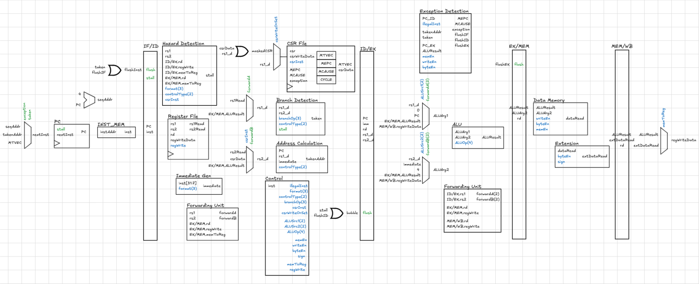

* Project Description

This repository contains a "Bare metal" RISC-V execution environment implementation. This implementation defines the following execution environment interface (EEI):

- A single unprivileged hart with initial state defined by power-on reset.

- The base integer ISA RV32I with FENCE, ECALL, and EBREAK executed as NOPs.

- A subset of the Zicsr and Zicntr extensions, namely the instructions:
  - CSRRW
  - CSRRS
  - RDCYCLE

- Available CSRs:
  - MTVEC
  - MEPC
  - MCAUSE
  - CYCLE

- Supported Exceptions:
  - Instruction address misaligned
  - Illegal Instruction
  - Load address misaligned
  - Store address misaligned

* Design and Implementation

This diagram is the canvas upon which the datapath design evolved. Its minimal nature encodes the essentials of the design while keeping it easy to iterate on. The tradeoff is that it does not serve as a strict implementation specification. Instead, it conveys architectural intent and intuition, leaving lower level details upto the implementation.

* Interface and Usage

The repository includes a standard bare-metal software + cocotb simulation flow for running arbitrary RV32I programs.

** Prerequisites

- RISC-V GNU toolchain (must provide ~riscv64-unknown-elf-gcc~)
- GHDL
- Python dependencies via ~uv~

Install Python dependencies:

#+begin_src sh
uv run --python 3.13 --with cocotb --with pyelftools python -c "import cocotb, elftools"
#+end_src

** Quick Start

Run the bundled [[file:sw/examples/test.c][example program:]]

#+begin_src sh
uv run --python 3.13 --with cocotb --with pyelftools make sim
#+end_src

Run your own program:

#+begin_src sh
uv run --python 3.13 --with cocotb --with pyelftools make sim PROG=path/to/program.c
#+end_src

** Execution Environment and Configuration

*** Pass/Fail and Host I/O

[[file:sw/crt0.S]] signals program termination to the host through MMIO:

- ~TOHOST_ADDR~ (default ~0x10000000~): write 32-bit exit code
  - ~0~ => PASS
  - non-zero => FAIL (value is reported)
    
The program can also produce console output by writing bytes to ~UART_TX_ADDR~ (default ~0x10000004~).

*** Runtime Internals (what runs during ~make sim~)

1. Build program ELF with ~riscv64-unknown-elf-gcc~ using:
   - startup: [[file:sw/crt0.S]]
   - linker script: [[file:sw/linker.ld]]
2. Launch GHDL on [[file:hw/Core.vhd]] (top-level ~core~).
3. Cocotb ([[file:tb/test_core.py]]) loads ELF segments into the memory model ([[file:tb/memory_model.py]]).
4. Simulation ends on tohost write or timeout.

*** Configuration Variables

All knobs are set via ~make~ variables:

- Program/build:
  - ~PROG~ (default ~sw/examples/test.c~)
  - ~MEM_SIZE~ (default ~64000~ bytes)
  - ~RAM_BASE~ (default ~0x00000000~)
  - ~TEXT_BASE~ (default ~$(RAM_BASE)~)
- Host/MMIO:
  - ~TOHOST_ADDR~ (default ~0x10000000~)
  - ~UART_TX_ADDR~ (default ~0x10000004~)
- Simulation:
  - ~MAX_CYCLES~ (default ~200000~)
  - ~SIM~ (default ~ghdl~)

Example:

#+begin_src sh
uv run --python 3.13 --with cocotb --with pyelftools \
  make sim PROG=sw/examples/test.c MEM_SIZE=131072 MAX_CYCLES=500000
#+end_src

* RISC-V Architectural Certification Tests

* Dhrystone Benchmark
